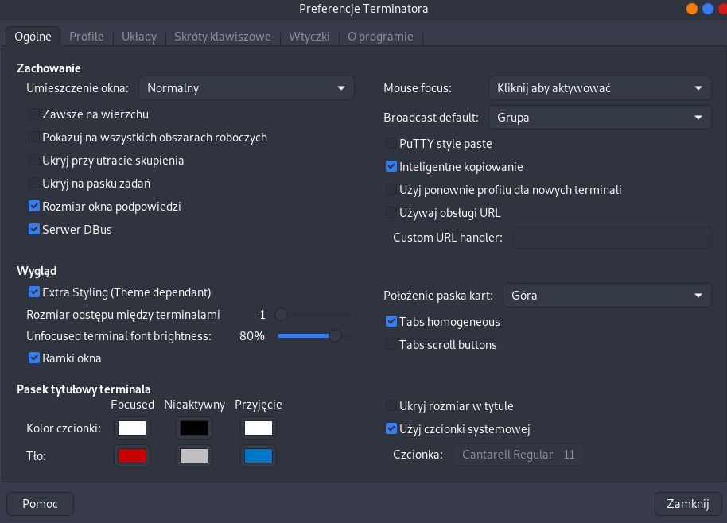
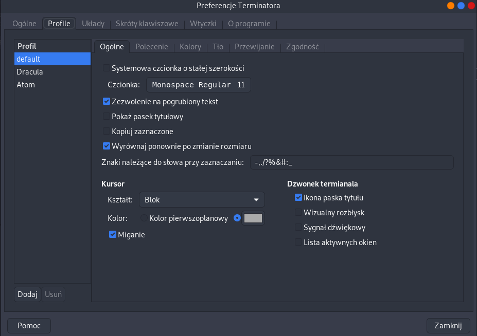

# ZSH tutorial

## Terminator
> `dnf install terminator`





> ~/.config/terminator/config

```bash
[global_config]
  enabled_plugins = TerminatorThemes, LaunchpadCodeURLHandler, APTURLHandler, LaunchpadBugURLHandler
  geometry_hinting = True
[keybindings]
[layouts]
  [[default]]
    [[[child0]]]
      fullscreen = False
      last_active_term = 276c4d35-dbc0-48ba-a973-05059686b5b7
      last_active_window = True
      maximised = False
      order = 0
      parent = ""
      position = 23:21
      size = 780, 499
      title = dawid@dawid-fedora:~/.config/terminator/plugins
      type = Window
    [[[terminal1]]]
      order = 0
      parent = child0
      profile = Candy
      type = Terminal
      uuid = 276c4d35-dbc0-48ba-a973-05059686b5b7
[plugins]
[profiles]
  [[default]]
    background_color = "#1e1f29"
    background_darkness = 0.9
    background_type = transparent
    cursor_color = "#aaaaaa"
    cursor_color_fg = False
    font = Monospace 11
    foreground_color = "#f8f8f2"
    palette = "#44475a:#ff5555:#50fa7b:#f1fa8c:#8be9fd:#bd93f9:#ff79c6:#94a3a5:#000000:#ff5555:#50fa7b:#f1fa8c:#8be9fd:#bd93f9:#ff79c6:#ffffff"
    show_titlebar = False
    use_system_font = False
  [[Atom]]
    background_color = "#161719"
    background_darkness = 0.85
    background_type = transparent
    cursor_color = "#d0d0d0"
    font = Monospace 11
    foreground_color = "#c5c8c6"
    palette = "#000000:#fd5ff1:#87c38a:#ffd7b1:#85befd:#b9b6fc:#85befd:#e0e0e0:#000000:#fd5ff1:#94fa36:#f5ffa8:#96cbfe:#b9b6fc:#85befd:#e0e0e0"
    show_titlebar = False
    use_system_font = False
  [[Dracula]]
    background_darkness = 0.85
    background_type = transparent
    cursor_color = "#aaaaaa"
    font = Monospace 11
    foreground_color = "#ffffff"
    show_titlebar = False
    use_system_font = False

```

### Terminator themes

- pip install requests
- mkdir -p $HOME/.config/terminator/plugins
- wget https://git.io/v5Zww -O $HOME"/.config/terminator/plugins/terminator-themes.py"

terminator > preferences > plugins and turn on Themes

## ZSH

> `dnf install zsh`

`chsh -s $(which zsh)` - set zsh as default

copy aliases from .bashrc to .zshrc

## install oh my zsh

`sh -c "$(curl -fsSL https://raw.githubusercontent.com/robbyrussell/oh-my-zsh/master/tools/install.sh)"`

### autosuggestions

`git clone https://github.com/zsh-users/zsh-autosuggestions ${ZSH_CUSTOM:-~/.oh-my-zsh/custom}/plugins/zsh-autosuggestions`

next in .zshrc in plugins add plugins=(zsh-autosuggestions)

### syntax highlighting

`git clone https://github.com/zsh-users/zsh-syntax-highlighting.git`

`echo "source ${(q-)PWD}/zsh-syntax-highlighting/zsh-syntax-highlighting.zsh" >> ${ZDOTDIR:-$HOME}/.zshrc`
